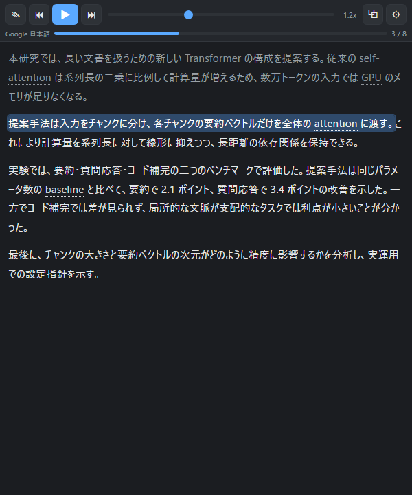
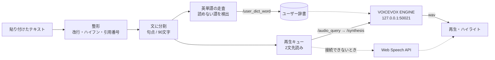

# paper-reader-voicevox

**論文の翻訳テキストを、VOICEVOX（ずんだもん）に読み上げさせるためのローカルアプリ。**

長い論文を目で追い続けるのは疲れる。かといって一般の読み上げに専門用語の英単語を渡すと、
`transformer` が「ティー・アール・エー…」と1文字ずつ読まれて聞くに堪えない。
このアプリは、**PDF からコピーした崩れたテキストを整形し、文ごとに区切って読み上げ、
読めない英単語を自動でカタカナ化して VOICEVOX の辞書に登録する**。
単一の HTML ファイルで動き、`npm install` も ビルドも要らない。


## 主な機能

- **貼り付けるだけ** — PDF からコピーしたテキストの、文中の改行・行末ハイフン・ページ番号だけの行・
  `[12]` のような引用番号を自動で整える（→ [ADR-0004](docs/adr/0004-split-and-prefetch.md)）
- **文ごとの読み上げ** — 読んでいる文がハイライトされ、文をクリックするとそこから再生。
  `Space` `←` `→` で操作。長い文は 90 文字で区切り、2 文先を先読みして途切れを防ぐ
- **読めない英単語を自動でカタカナ化** — 読み込み時に、VOICEVOX が1文字読みしてしまう英単語を検出し、
  内蔵辞書（論文頻出の 67 語）と綴りからの変換規則でカタカナにして
  **ユーザー辞書に登録する**。頭字語（AI・GPU）は1文字読みのまま残す（→ [ADR-0003](docs/adr/0003-english-word-detection.md)）
- **読みをその場で直す** — 本文の英単語を右クリックすると読みの編集バーが出る。登録は VOICEVOX 側に永続する
- **VOICEVOX が無くても動く** — 接続できなければブラウザ内蔵の音声（Web Speech API）に切り替わる
  （→ [ADR-0002](docs/adr/0002-voicevox-with-web-speech-fallback.md)）
- **最前面の小窓** — Document Picture-in-Picture で、他の作業をしながら再生位置を見られる
- **Windows ランチャー** — ダブルクリックで VOICEVOX ENGINE を裏で起動し、専用ウィンドウで開く。
  ウィンドウを閉じると、自分が起動したエンジンだけを止める（→ [ADR-0005](docs/adr/0005-edge-app-launcher.md)）

## スクリーンショット

読み上げ中：読んでいる文がハイライトされ、英単語には点線が付く（右クリックで読みを直せる）。
上のバーは再生・前後の文・速度、右端は最前面の小窓と設定。



## クイックスタート

```bash
git clone https://github.com/1f10230039/paper-reader-voicevox.git
```

1. [VOICEVOX](https://voicevox.hiroshiba.jp/) を入れる（エンジンだけの配布物 `vv-engine` でもよい）
2. `reader.html` をブラウザで開く
3. テキストを貼り付けて **読み込んで再生**

VOICEVOX が動いていなければ、ブラウザ内蔵の音声で読み上げる。
Windows なら `launch.vbs` をダブルクリックすれば、エンジンの起動から専用ウィンドウの表示まで自動でやる
（→ [使い方](docs/usage.md)）。

## 仕組み（概要）



- **すべて `reader.html` の中**。UI・整形・分割・英単語の判定・再生・辞書の操作が 1 ファイルに収まる
- 合成結果は `話者|速度|文` を鍵に Promise ごとキャッシュし、先読みと本再生が同じ結果を共有する
- 英単語が「読めていない」かどうかは、エンジンが返す読み（`kana`）が
  **アルファベット1文字読みの並びになっているか**で判定する

詳細は [アーキテクチャ概要](docs/architecture.md) を参照。

## ディレクトリ構成

```
├── reader.html        # 本体。UI・再生・整形・英単語の辞書処理すべて
├── launch.vbs         # ランチャー（Windows）。コンソールを出さずに launch.ps1 を呼ぶ
├── launch.ps1         # エンジン起動 → Edge の専用ウィンドウ → 終了時にエンジン停止
├── icon.ico           # ショートカット用のアイコン
└── docs/
    ├── usage.md
    ├── architecture.md
    ├── adr/           # 設計判断の記録
    └── images/
```

## ドキュメント

| ドキュメント | 内容 |
|---|---|
| [使い方](docs/usage.md) | 起動・ランチャーの仕組み・キー操作・英単語の読みの直し方 |
| [アーキテクチャ概要](docs/architecture.md) | 処理の流れ・VOICEVOX API の使い方・英単語判定・キャッシュ |
| [ADR 一覧](docs/adr/README.md) | 主要な設計判断の記録（6 件） |

## 開発

ビルド工程は無い。`reader.html` を書き換えてブラウザを更新するだけ。

```bash
# JS 部分だけ取り出して構文チェック
sed -n '/<script>/,/<\/script>/p' reader.html | sed '1d;$d' > /tmp/reader.js && node --check /tmp/reader.js
```

`launch.ps1` は **BOM 付き UTF-8** で保存すること（無いと PowerShell 5.1 が Shift-JIS として読み、日本語パスが壊れる）。

## ライセンス

このリポジトリのコードは [MIT](LICENSE)。

VOICEVOX ENGINE と音声ライブラリは同梱していない。利用にあたっては
[VOICEVOX の利用規約](https://voicevox.hiroshiba.jp/term/) と各キャラクターの規約に従うこと。
作成した音声を公開する場合は「VOICEVOX:ずんだもん」のようなクレジット表記が必要になる。
