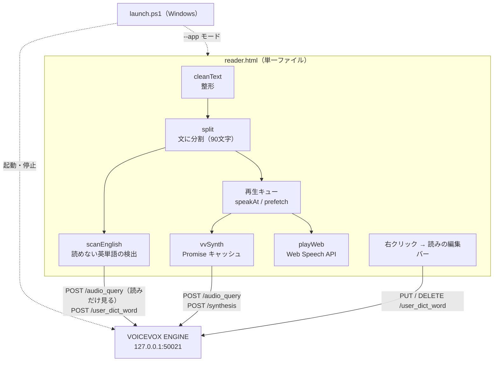

# アーキテクチャ概要

## 全体像

サーバーは持たない。ページは `file://` から開き、VOICEVOX ENGINE の HTTP API を直接叩く。
エンジンが無ければ、ブラウザ内蔵の `speechSynthesis` に切り替わる。

## 処理の流れ

### 1. 整形（`cleanText`）

PDF からコピーしたテキストは、行ごとに改行が入り、英単語が行末でハイフン分断され、
ページ番号や引用番号が本文に混ざっている。読み上げに渡す前にこれを直す。

| 処理 | 例 |
|---|---|
| ページ番号だけの行を捨てる | `— 12 —` |
| 英単語の行末ハイフンを繋ぐ | `trans-⏎former` → `transformer` |
| 引用番号を落とす | `[12]` `[3, 4]` `[5–7]` |
| 文中の改行を繋ぐ | 行末が句点・閉じ括弧で終わっていなければ次の行と連結。英数字どうしなら空白を挟む |
| 空行は段落として残す | 3 行以上の空行は 2 行に詰める |

### 2. 分割（`split`）

句点で文に分け、90 文字を超える文は読点で分ける。
1 発話を短く保つことは、シークの粒度と、ブラウザ内蔵音声が長文で止まる癖の回避を兼ねている
（→ [ADR-0004](adr/0004-split-and-prefetch.md)）。各文は元の段落番号を持ち、段落ごとに描画される。

### 3. 英単語の走査（`scanEnglish`）

読み込み時に一度だけ走る。VOICEVOX につながっていないときは何もしない。

1. 本文から英単語（3 文字以上）を集め、ハイフン語は分ける（VOICEVOX が別々に読むため）
2. ユーザー辞書に登録済みの語を除く
3. 残りをエンジンの `/audio_query` に投げ、返ってくる読み（`kana`）だけを見る（同時 6 件）
4. 読みが **アルファベット 1 文字読みの並び** になっていれば「読めていない」と判定する
5. 頭字語（全部大文字 2〜5 文字）は 1 文字読みが正しいので除く。ただし内蔵辞書にある語は登録する
6. 内蔵辞書（`BUILTIN`、67 語）にあればその読み、無ければ綴りからの変換規則（`katakanize`）でカタカナを作る
7. `/user_dict_word` に登録し、合成キャッシュを捨てる

「読めていない」の判定を完全一致にしないのは、文字によって読みが揺れるため（`z` が「ゼット」にも「ズィイ」にもなる）。
各文字の読みが順番に現れるか、かつ全体が 1 文字あたり 2 カナ以上に膨らんでいるか、で見る
（→ [ADR-0003](adr/0003-english-word-detection.md)）。

`katakanize` は、語尾のパターン（`-tion` → ション、`-able` → アブル など）を先に切り出し、
残りを子音＋母音の並びで音節にしていく規則変換。完全に正しい読みにはならないが、
聞いて何の語か分かる水準を狙っている。

### 4. 再生（`speakAt` → `playVV` / `playWeb`）

- 現在の文を合成して再生し、終わったら次の文へ進む
- **2 文先まで先読み**する（`prefetch`）。合成は文の長さに比例して時間がかかるので、
  再生中に次を作っておかないと文と文の間が空く
- 合成結果は `話者|速度|文` を鍵に **Promise ごと**キャッシュする。先読みが作った Promise を
  本再生がそのまま待つので、同じ文を二度合成しない。失敗した Promise はキャッシュから外す
- 発話には世代番号（`seq`）を付け、停止・ジャンプで捨てた発話の完了イベントが
  次の文を進めてしまわないようにしている

### 5. VOICEVOX との接続（`vvWatch`）

起動時に `/version` へ疎通確認し、成功したら `/speakers` と `/user_dict` を読む。
失敗しても 1.2 秒おきに 45 回まで再試行するので、ランチャーがエンジンを立ち上げている最中でも
ページを先に開いておける。つながるまでは Web Speech API で読める。

## 使っている VOICEVOX ENGINE の API

| API | 用途 |
|---|---|
| `GET /version` | 疎通確認 |
| `GET /speakers` | 話者の一覧（音声の選択肢） |
| `POST /audio_query?speaker=&text=` | 音声合成用のクエリ。英単語の走査ではこの `kana` だけを使う |
| `POST /synthesis?speaker=` | wav の生成。`speedScale` で速度を指定 |
| `GET /user_dict` | ユーザー辞書の一覧 |
| `POST /user_dict_word` | 語の登録（`accent_type=0`） |
| `PUT /user_dict_word/{uuid}` | 読みの修正 |
| `DELETE /user_dict_word/{uuid}` | 削除 |

## 状態の保存

`localStorage` の 1 キー（`yomiage.v2`）に、テキスト・再生位置・速度・話者・文字サイズ・テーマ・
整形のオンオフをまとめて保存する。次に開いたときは続きから始まる。

## ランチャー（`launch.ps1`）

Windows で「ダブルクリック → 読める状態」までを 1 手にするためのもの。

- エンジンを `--host 127.0.0.1 --port 50021 --allow_origin null` で起動する。
  `file://` から開くページの origin は `null` なので、これが無いと CORS で弾かれる（→ [ADR-0006](adr/0006-allow-origin-null.md)）
- Edge を **専用プロファイル**の `--app` モードで開く。プロファイルを分けないと既存の Edge に吸収され、
  ウィンドウを閉じてもプロセスが終わらず、エンジンを止めるタイミングが取れない
  （→ [ADR-0005](adr/0005-edge-app-launcher.md)）
- エンジンの準備ができたら「あ」を一度合成して、初回合成の待ち時間を消す
- ウィンドウが閉じたら、**自分が起動したエンジンだけ**を子プロセスごと止める

## 設計の勘所（踏んだところ）

- `speechSynthesis.cancel()` の直後の `speak()` は Chromium で無視されることがある。一拍（60ms）置いてから呼ぶ
- `cancel()` 由来の `onend` / `onerror` が次の文を進めてしまう。発話に世代番号を付けて弾く
- 英単語の「読めていない」判定を完全一致にすると、`z` の読み揺れですり抜ける
- ハイフンで繋いだ英単語は VOICEVOX が別々の語として読むので、辞書登録も分けて行う
- `launch.ps1` は BOM 付き UTF-8 で保存する。無いと PowerShell 5.1 が日本語パスを壊す
- Document Picture-in-Picture の小窓は、元のタブを閉じると一緒に閉じる
